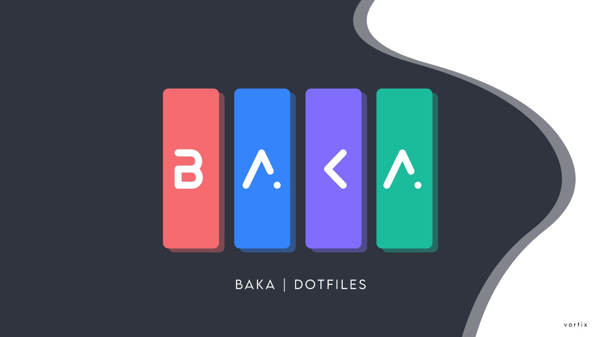
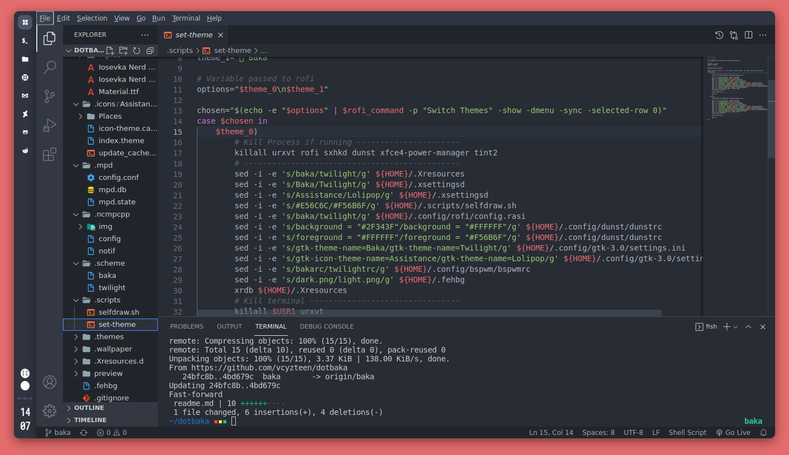
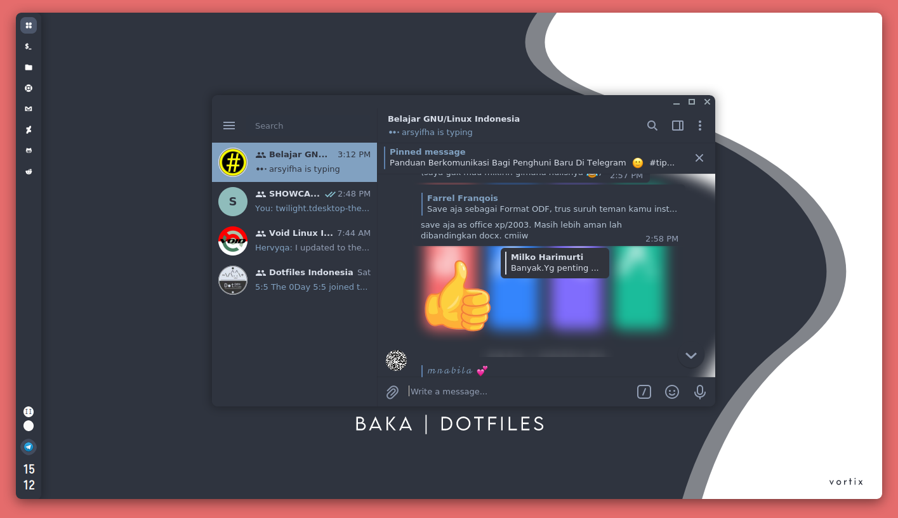
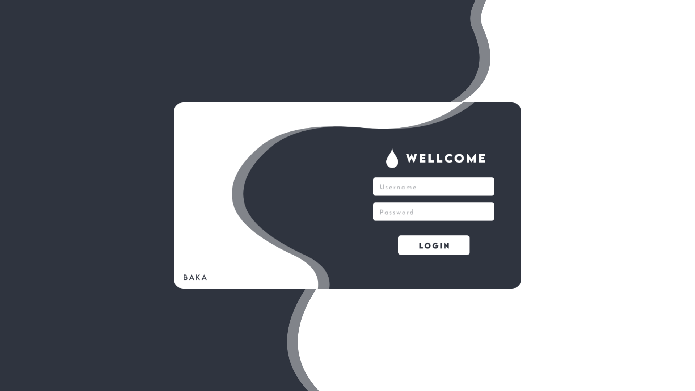

<p align="center">

<p align="center">  

<h3><b><p align="center">P R E V I E W - W A L L P A P E R</p></b></h3>

<p align="center">
<p align="center">

<b><p align="center">You are welcome if you want to take the part you want or change it on your own device</p></b>

* **Installasion**

```bash
$ git clone https://github.com/vcyzteen/dotbaka && cd dotbaka
```
```bash
$ chmod +x preinstalled && ./preinstalled
```
```bash
$ rsync -avxHAXP --exclude '.git*' .* ~/
```
```bash
$ fc-cache -rv
```

- **Compositor <kbd>suggested</kbd>**
  <details>
  <summary><strong>See</strong></summary>

  * Instructions for building `picom-ibhagwan` on void linux using `xbps-src`:
    1. Setup the `void-packages` repo:

    ```sh
    $ git clone --depth=1 https://github.com/void-linux/void-packages
    $ cd void-packages
    $ ./xbps-src binary-bootstrap
    $ echo XBPS_ALLOW_RESTRICTED=yes >> etc/conf
    ```
    2. Download the template repo and copy into `srcpkgs`:

    ```sh
    $ git clone https://github.com/ibhagwan/picom-ibhagwan-template
    $ mv picom-ibhagwan-template ./srcpkgs/picom-ibhagwan
    ```
    3. Build & install the package:

    ```sh
    $ ./xbps-src pkg picom-ibhagwan
    $ sudo xbps-install --repository=hostdir/binpkgs picom-ibhagwan 
    ```
    **Note #1:** if you have `xtools` installed you can install the package by running `xi -f picom-ibhagwan` (instead of using `xbps-install`).

    **Note #2:** before installing the package make sure to remove all other `compton|picom` packages with `sudo xbps-remove picom && sudo xbps-remove compton`.
  
  * Picom For Artix [ Aur ] | ```yay -S picom-ibhagwan-git```

- **VSCode Themes & Icons <kbd>optional</kbd>**
  <details>
  <summary><strong>See</strong></summary>
    
    <p align="center">
    </p>
    
    <p align="center"><a href="https://github.com/PKief/vscode-material-icon-theme" />I C O N - T H E M E </a> | <a href="https://github.com/akamud/vscode-theme-onedark" /> T H E M E - V S C O D E</a></p>

- **Telegram Theme <kbd>optional</kbd>**
  <details>
  <summary><strong>See</strong></summary>

  <p align="center">

  <p align="center"><a href="https://github.com/vcyzteen/Telegram-theme" /> T E L E G R A M - T H E M E </a>

- **SLIM Theme <kbd>optional</kbd>**
  <details>
  <summary><strong>See</strong></summary>

  <p align="center">

  <p align="center"><a href="https://drive.google.com/drive/folders/1_Ktq9kGqDi0TNC8Q49AWpLo2HvWkPhnQ" /> S L I M - T H E M E </a>
  
  	* *<b>Installasion See <a href="https://wiki.archlinux.org/title/SLiM">Archwiki<a/></b>*

```
|-----------------------|-------------------------|
|        Keybind        | Fungsi                  |
|-----------------------|-------------------------|
|   Open Rofi - Menu    | Super + Space           |
|-----------------------|-------------------------|
|    Open - Terminal    | Super + Enter	          |
|-----------------------|-------------------------|
|   Screenshot - Now    | Print [ PrtSc ]         |
|-----------------------|-------------------------|
|  Screenshots - Half   | Alt + Print [ PrtSc ]   |
|-----------------------|-------------------------|
|     Reload sxhkd      | Super + Escape          |
|-----------------------|-------------------------|
|     Switch Theme      | Super + Z	          |
|-----------------------|-------------------------|
```
* Inspiration Resources
  * [اَدِّيْ](https://github.com/addy-dclxvi)
  * [Harry](https://github.com/owl4ce)
  * [Ibhagwan](https://github.com/ibhagwan)
  * [Aditya Shakya](https://github.com/adi1090x)
  * [Risky Nur Assyaufi](https://github.com/bandithijo)

* Wallpaper Anime ( soon )
  * [Pixiv](https://pixiv.net)
  * [Safebooru](https://safebooru.donmai.us)

* By The Way
  * I made info like this because if maybe someone wants to use it simply without wanting to be difficult, you can try it (actually I'm a little reluctant because this repo not good) to share this source but after I thought it would be better if I was easy to use it too & and clone became even better easy of course without having to enter the pswd github first :)

<h3><b><p align="center">- - - T H A N K S - F O R - V I S I T I N G - - -</p></b></h3>
